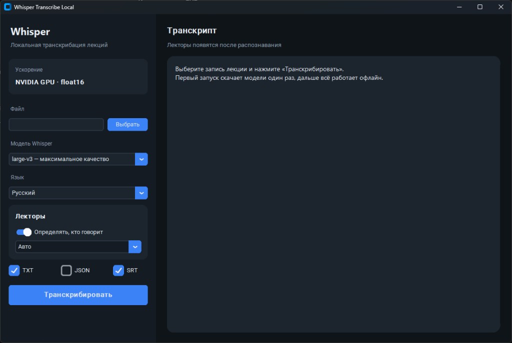

# Whisper-transcribe local

Бесплатная транскрибация аудио и видео на Windows через [faster-whisper](https://github.com/SYSTRAN/faster-whisper). Работает офлайн после первого скачивания модели.



## Возможности

- Современный интерфейс на CustomTkinter
- Определение лекторов (кто говорит)
- Полоски прогресса загрузки модели и транскрибации
- Модели от `tiny` до `large-v3`
- Ускорение на NVIDIA GPU (CUDA)
- Экспорт в `.txt`, `.json` и `.srt` с именами лекторов
- Русский, английский, украинский и автоопределение языка

## Готовый EXE

Скачайте архив из [Releases](https://github.com/Invect1ved/Whisper-transcribe-local/releases), распакуйте и запустите `WhisperTranscribe.exe`.

Python ставить не нужно. Модель скачается при первом распознавании. Для ускорения нужна видеокарта NVIDIA.

## Требования (запуск из исходников)

- Windows 10/11
- Python 3.12+
- FFmpeg
- NVIDIA GPU (опционально, для ускорения)

## Установка из исходников

```powershell
winget install Python.Python.3.12
winget install Gyan.FFmpeg
```

Клонируйте репозиторий и запустите установку:

```powershell
git clone <url-репозитория>
cd whisper-transcribe
.\setup.bat
```

## Запуск

```powershell
.\run.bat
```

Или вручную:

```powershell
.\.venv\Scripts\pythonw.exe transcribe_app.py
```

## Использование

1. Нажмите «Выбрать» и укажите аудио или видео файл.
2. При необходимости включите «Определять, кто говорит» и укажите число лекторов.
3. Выберите модель (по умолчанию `large-v3`).
4. Выберите формат сохранения: TXT, JSON и/или SRT.
5. Нажмите «Транскрибировать» и следите за полосками прогресса.
6. Результат сохранится рядом с исходным файлом.

При первом запуске выбранная модель скачается в `%USERPROFILE%\.cache\huggingface`.

## Структура проекта

```
whisper-transcribe/
├── transcribe_app.py        # интерфейс
├── diarize.py               # определение лекторов
├── docs/screenshot.png      # скрин главного экрана
├── requirements.txt         # зависимости Python
├── setup.bat                # установка окружения
├── run.bat                  # запуск GUI
├── WhisperTranscribe.spec   # сборка EXE
├── build_exe.ps1            # скрипт сборки релиза
└── README.md
```

## Лицензия

MIT
